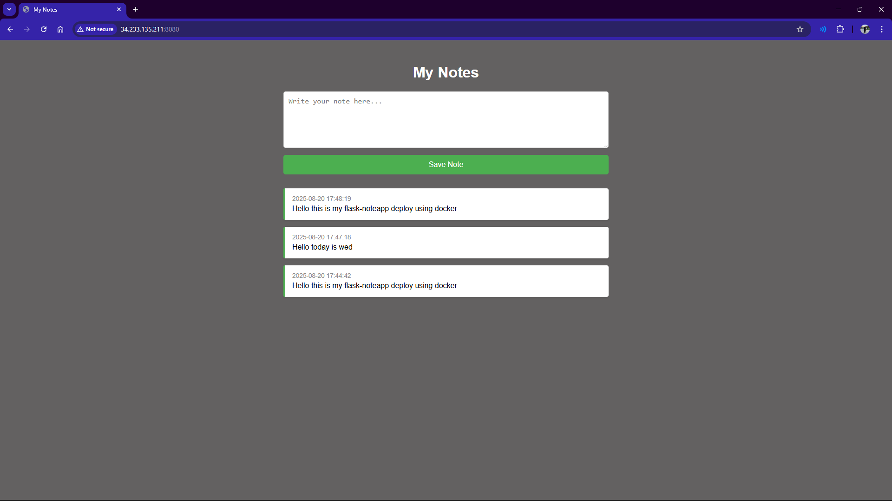

# 📝 Flask Notes App (Docker + MySQL + Compose)

A simple **note-taking web application** built with **Flask** and **MySQL**, containerized with **Docker**, and orchestrated using **Docker Compose**.

This project demonstrates:

- Building a minimal Flask web service with **HTML UI** and **JSON API**.
- Persisting notes in **MySQL**.
- Multi-container orchestration with **Docker Compose**.

---



---

## 📂 Project Structure

```
flask-notes/
│
├── app/
│   ├── app.py               # Flask application
│   ├── requirements.txt     # Python dependencies
│   ├── templates/
│   │   └── index.html       # UI template
│   └── static/
│       └── style.css        # Stylesheet
│
├── db/
│   └── init.sql             # Database initialization script
│
├── Dockerfile               # Dockerfile for Flask app
├── docker-compose.yml       # Compose configuration
├── .env.example             # Example environment variables

```

---

## 🚀 Deployment Steps

1. **Install Docker**: Ensure Docker is installed on your local machine.
   ```bash
   sudo yum install ansible
   ```
2. **Verify installations**:
   ```bash
   docker --version
   docker compose version
   ```
3. **Start & Enable Docker**:

   ```bach
   systemctl start docker
   systemctl enable docker
   ```

4. **Copy environment file**:
   ```bash
   cp .env.example .env
   ```
   5.**Build & Run**: Start the entire stack (Flask + MySQL) with:
   ```bash
   docker compose up --build -d
   ```
5. **Access the Application**: Open your web browser and navigate to `http://machine-IP:8080` to view the Note-Taking Website.

---

## 🛠️ Project Breakdown

```
flask-notes/
│
├── app/
│   ├── app.py               # Flask application
│   ├── requirements.txt     # Python dependencies
│   ├── templates/
│   │   └── index.html       # UI template
│   └── static/
│       └── style.css        # Stylesheet
│
├── db/
│   └── init.sql             # Database initialization script
│
├── Dockerfile               # Dockerfile for Flask app
├── docker-compose.yml       # Compose configuration
├── .env.example             # Example environment variables

```

---

# flask-notes/app/app.py

```python
from flask import Flask, request, render_template, jsonify
import mysql.connector
from mysql.connector import Error
from datetime import datetime
import os

app = Flask(__name__)

# Load DB config from env vars
DB_HOST = os.getenv("DB_HOST", "db")
DB_USER = os.getenv("DB_USER", "root")
DB_PASSWORD = os.getenv("DB_PASSWORD", "rootpassword")
DB_NAME = os.getenv("DB_NAME", "notesdb")

def get_db_connection():
    return mysql.connector.connect(
        host=DB_HOST,
        user=DB_USER,
        password=DB_PASSWORD,
        database=DB_NAME
    )

@app.route("/", methods=["GET", "POST"])
def index():
    if request.method == "POST":
        content = request.form.get("content", "").strip()
        if content:  # Reject empty notes
            created_at = datetime.now().strftime("%Y-%m-%d %H:%M:%S")
            conn = get_db_connection()
            cursor = conn.cursor()
            cursor.execute(
                "INSERT INTO notes (content, created_at) VALUES (%s, %s)",
                (content, created_at),
            )
            conn.commit()
            cursor.close()
            conn.close()

    conn = get_db_connection()
    cursor = conn.cursor(dictionary=True)
    cursor.execute("SELECT * FROM notes ORDER BY id DESC")
    notes = cursor.fetchall()
    cursor.close()
    conn.close()
    return render_template("index.html", notes=notes)

# API: Create a note
@app.route("/notes", methods=["POST"])
def create_note():
    data = request.get_json()
    content = data.get("content", "").strip()
    if not content:
        return jsonify({"error": "Content cannot be empty"}), 400

    created_at = datetime.now().strftime("%Y-%m-%d %H:%M:%S")
    conn = get_db_connection()
    cursor = conn.cursor()
    cursor.execute(
        "INSERT INTO notes (content, created_at) VALUES (%s, %s)",
        (content, created_at),
    )
    conn.commit()
    note_id = cursor.lastrowid
    cursor.close()
    conn.close()

    return jsonify({"id": note_id, "content": content, "created_at": created_at}), 201

# API: List notes
@app.route("/notes", methods=["GET"])
def list_notes():
    conn = get_db_connection()
    cursor = conn.cursor(dictionary=True)
    cursor.execute("SELECT * FROM notes ORDER BY id DESC")
    notes = cursor.fetchall()
    cursor.close()
    conn.close()
    return jsonify(notes)

# Health check
@app.route("/healthz", methods=["GET"])
def healthz():
    try:
        conn = get_db_connection()
        cursor = conn.cursor()
        cursor.execute("SELECT 1")
        cursor.fetchone()
        cursor.close()
        conn.close()
        return jsonify({"status": "ok"}), 200
    except Error as e:
        return jsonify({"status": "error", "details": str(e)}), 500

if __name__ == "__main__":
    app.run(host="0.0.0.0", port=5000)

```

---

# flask-notes/app/templates/index.html

```html
<!DOCTYPE html>
<html lang="en">
  <head>
    <meta charset="UTF-8" />
    <title>My Notes</title>
    <link rel="stylesheet" href="/static/style.css" />
  </head>
  <body>
    <h1>My Notes</h1>

    <form method="post">
      <textarea
        name="content"
        placeholder="Write your note here..."
        required
      ></textarea>
      <button type="submit">Save Note</button>
    </form>

    
    <div class="note">
      <time> {{ note['created_at'] }}</time>
      <p>{{ note['content'] }}</p>
    </div>
    
  </body>
</html>
```

---

# flask-notes/app/static/style.css

```css
body {
  font-family: Arial, sans-serif;
  background-color: #636161;
  padding: 30px;
  max-width: 700px;
  margin: auto;
}

h1 {
  color: #ffffff;
  text-align: center;
}

form {
  margin-bottom: 30px;
  display: flex;
  flex-direction: column;
}

textarea {
  min-height: 100px;
  padding: 10px;
  font-size: 16px;
  border-radius: 5px;
  border: 1px solid #ccc;
  margin-bottom: 15px;
}

button {
  background-color: #4caf50;
  color: white;
  padding: 12px;
  border: none;
  border-radius: 5px;
  font-size: 16px;
  cursor: pointer;
}

.note {
  background-color: #fff;
  padding: 15px;
  margin-bottom: 15px;
  border-left: 4px solid #4caf50;
  border-radius: 4px;
  box-shadow: 0 2px 4px rgba(0, 0, 0, 0.1);
}

.note time {
  font-size: 0.85em;
  color: #888;
  display: block;
  margin-bottom: 5px;
}

.note p {
  margin: 0;
}

.note button {
  background-color: #f44336;
  margin-top: 10px;
}
```

---

# roles/deploy/files/backup.sh

```bash
#!/bin/bash
DATE=$(date +%Y%m%d_%H%M%S)
cp /home/ec2-user/notes.db /home/ec2-user/backup_notes_$DATE.db
echo "Backup created: backup_notes_$DATE.db"
```

---

# flask-notes/app/requirements.txt

```
Flask==3.0.0
mysql-connector-python==9.0.0

```

---

# flask-notes/db/init.sql

```sql
CREATE TABLE IF NOT EXISTS notes (
    id INT AUTO_INCREMENT PRIMARY KEY,
    content TEXT NOT NULL,
    created_at TIMESTAMP DEFAULT CURRENT_TIMESTAMP
);
```

---

# flask-notes/Dockerfile

```Dockerfile
FROM python:3.10-slim

# Create a non-root user
RUN adduser --disabled-password --gecos '' flaskuser

# Set working directory
WORKDIR /app

# Copy requirements and install
COPY app/requirements.txt .
RUN pip install --no-cache-dir -r requirements.txt

# Copy app code
COPY app/ .

# Switch to non-root user
USER flaskuser

EXPOSE 5000

CMD ["python", "app.py"]
```

---

# flask-notes/docker-compose.yml

```yaml
version: "3.9"

services:
  db:
    image: mysql:8.0
    container_name: notes-db
    restart: always
    environment:
      MYSQL_ROOT_PASSWORD: ${MYSQL_ROOT_PASSWORD}
      MYSQL_DATABASE: ${MYSQL_DATABASE}
      MYSQL_USER: ${MYSQL_USER}
      MYSQL_PASSWORD: ${MYSQL_PASSWORD}
    volumes:
      - db_data:/var/lib/mysql
      - ./db/init.sql:/docker-entrypoint-initdb.d/init.sql:ro
    healthcheck:
      test: ["CMD", "mysqladmin", "ping", "-h", "localhost"]
      interval: 10s
      timeout: 5s
      retries: 5

  web:
    build: .
    container_name: notes-web
    restart: always
    ports:
      - "8080:5000"
    environment:
      DB_HOST: db
      DB_USER: ${MYSQL_USER}
      DB_PASSWORD: ${MYSQL_PASSWORD}
      DB_NAME: ${MYSQL_DATABASE}
    depends_on:
      db:
        condition: service_healthy
    healthcheck:
      test: ["CMD", "curl", "-f", "http://localhost:5000/healthz"]
      interval: 10s
      timeout: 5s
      retries: 5

volumes:
  db_data:
```

---

# flask-notes/.env

```
MYSQL_ROOT_PASSWORD=changethis
MYSQL_DATABASE=notesdb
MYSQL_USER=notesuser
MYSQL_PASSWORD=notespwd
```

---
